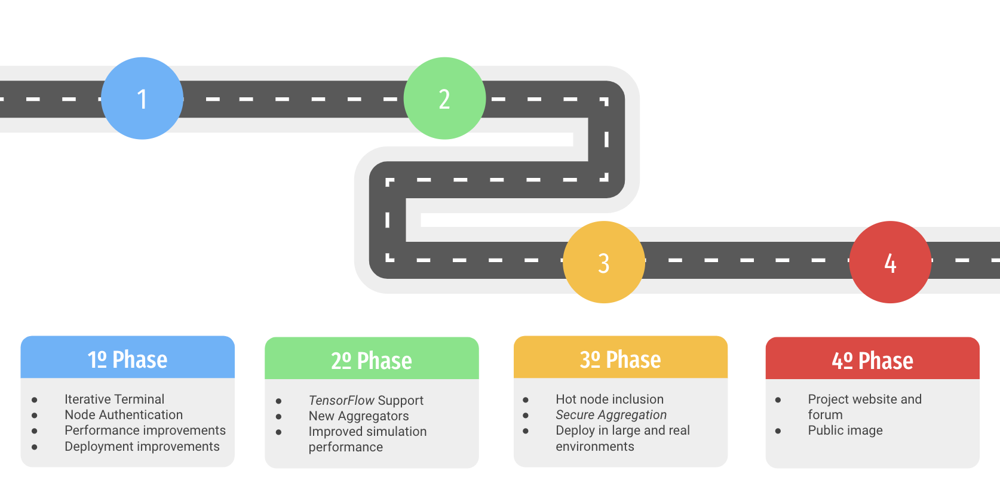

# P2PFL - Federated Learning over P2P networks

[](https://github.com/pguijas/federated_learning_p2p/blob/main/LICENSE.md)
[](https://github.com/pguijas/federated_learning_p2p/issues)


P2PFL is a general-purpose open-source library for the execution (simulated and in real environments) of Decentralized Federated Learning systems, specifically making use of P2P networks and the Gossisp protocol.

## 📚 Documentation

- [Documentation](https://pguijas.github.io/federated_learning_p2p/).

- [Report of the end-of-degree project](other/memoria.pdf).

- [Report for the award for the best open source end-of-degree project](other/memoria-open-source.pdf).

## ✅ Features

- Easy to use and extend
- Fault tolerant
- Decentralized and Scalable
- Simulated and real environments
- Privacy-preserving
- Framework agnostic

## 📥 Installation

---

- diferenciar entre instalación con pip y setup para desarrollo

- python 3.9 / fallando con versiones superiores por compatibilidad con torch

---

To install the library, you can simply run:

```bash
pip install p2pfl
```

## 🚀 TO DO

- add examples
- plantearse uso de excepciones propias (grpc) -> más control (tipos de errores en la comunicación -> EN UN BAD MSG QUE NO APAREZCA UN CONN CLOSED -> FACILITAR DEBUG AL USUARIO)
- mensajes de paso de ronda para abortar entrenamientos de nodos rezagados
- añadir comprobaciones adicionales en la agregación de modelos/metricas/votos
- doc
- pulir deploy: multiples versiones + actualizar a versiones recientes de pytorch + añadir tensorflow
- add secure channels
- Plantearse encapsular estado en un objeto -> Creo que innecesario pero revisarlo
- meter simulación
- panel de control -> web + terminal
- meter tipado?
- num samples en métricas para graficas agregadas ponderadas

don't be shy, share your ideas with us!

### Roadmap



## 👫 Contributing

Contributions are always welcome!

See `CONTRIBUTING.md` for ways to get started.

Please adhere to this project's code of conduct specified in `CODE_OF_CONDUCT.md`.

## 💬 Google Group

If you have any questions, or you to be notified of any updates, you can join the Google Group [here](https://groups.google.com/g/p2pfl).

## 📜 License

[GNU General Public License, Version 3.0](https://www.gnu.org/licenses/gpl-3.0.en.html)