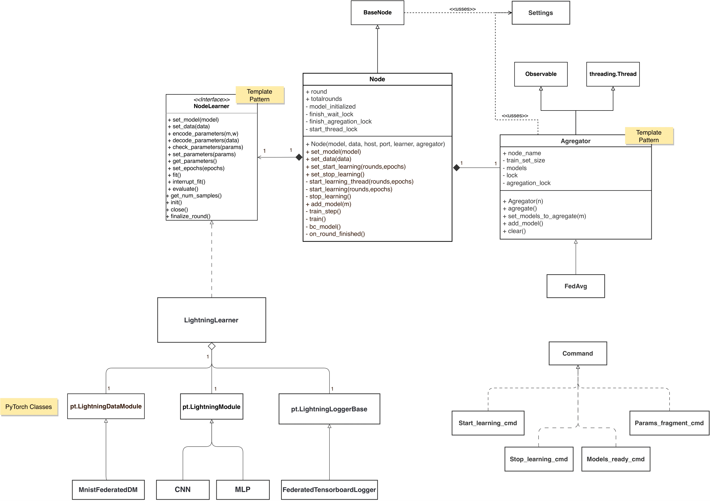

# Library Design

This document describes the design of the library.

## Design Principles

First of all, its important to keep in mind some design principles that were followed during the development of the library. Some of them are: SOLID principles, KISS, DRY, YAGNI, etc.

## General Overview

The library has been structured, in general, following a design in which the node has different components.

The class diagrams of the different parts of the library are shown below.

### Node without learning

### Node with learning

### Gosspip protocol

### Encryption

## Design Patterns

The library has been structured following some design patterns. The most important ones are:

- **Observer pattern**: Used to manage the communication between the different components of the node and the node.

- **Command pattern**: Used to create the communication protocol.

- **Template pattern**: Used to make the library extremely extensible.

## Communication Protocol

To know more about the communication protocol, see the `communication_protocol module` at [documentation](p2pfl.rst).
