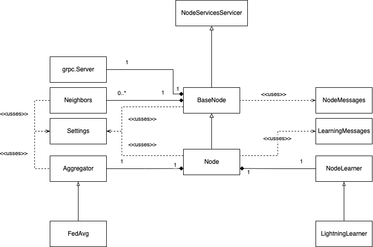

# Library Design

This document describes the design of the library.

## Design Principles

First of all, its important to keep in mind some design principles that were followed during the development of the library. Some of them are: SOLID principles, KISS, DRY, YAGNI, etc.

## General Overview

The library has been structured following 2 implementations of the node: the first one allows p2p communication using GRPC and the next one extends the first one to allow node learning.

Since a p2p architecture is followed, the `BaseNode` will be a service provider as well as a consumer (using the `Neighbors` class). As for `Node`, its modular operation related to federated learning will depend on the `Aggregator` and `NodeLearner` components. These, thanks to the template pattern and strategy, will allow an easy extension of the library, as well as an agnostic character to the implementation of the learning algorithms.

Note that the `send_message` remote call will be used for message passing (not including model exchange), following a similar approach to the command pattern but using callbacks.

